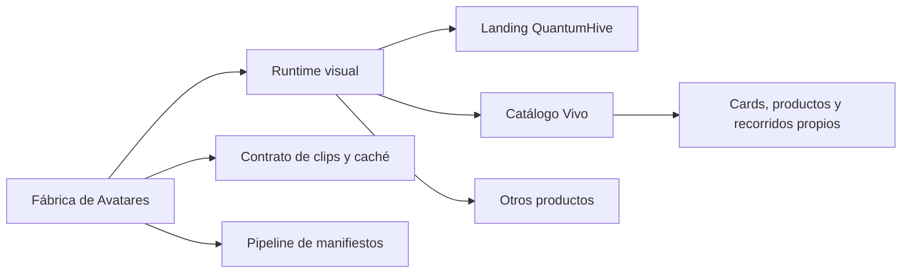

# Fábrica de Avatares

Base independiente y reutilizable del avatar de QuantumHive. Este repositorio contiene el runtime visual, los chips autoguiados, el contrato de assets y las herramientas para construir y validar manifiestos de caché.

No contiene cartas, productos, platos ni lógica de Catálogo Vivo. Esos productos consumen esta fábrica como un módulo.

## Qué queda resuelto en esta base

- reproductor con dos capas: biblioteca de idles + clips de acción;
- chips declarativos atados a clips, destinos visuales y próximos pasos;
- retorno automático al idle cuando termina una acción;
- rotación de idles sin repetir inmediatamente y con idle de espera larga;
- precarga de los videos declarados en el manifiesto;
- fallback visual cuando un video no está disponible;
- modo compacto para abrir un chat sin hacer desaparecer al avatar;
- generador y validador de manifiestos para un caché externo;
- demo desacoplada del Catálogo Vivo.

## Ejecutar la demo

```bash
npm install
npm run dev
```

La demo usa temporalmente los clips públicos del prototipo desplegado. Para usar Supabase Storage:

```bash
VITE_AVATAR_ASSET_BASE_URL=https://<proyecto>.supabase.co/storage/v1/object/public/avatar-cache/<tenant>/<rubro>/<avatar>/<version> npm run dev
```

En Windows se puede crear un archivo `.env.local` copiando `.env.example` y ejecutar `npm.cmd run dev`.

## Controles

```bash
npm run check
npm run avatar:validate
```

Para generar un manifiesto desde clips locales (los videos quedan ignorados por Git):

```bash
npm run avatar:manifest -- --input local-assets/sol/v1 --base-url https://cdn.example.com/tenant/rubro/sol/v1 --avatar sol --version v1 --output generated/sol-v1.manifest.json
```

## Límite entre fábrica y productos



La aplicación consumidora decide qué significa cada chip y qué sección debe mostrar. La fábrica sólo ejecuta la reacción visual y emite eventos.

Más detalle en [docs/ARCHITECTURE.md](docs/ARCHITECTURE.md) y [docs/ASSET-CONTRACT.md](docs/ASSET-CONTRACT.md).
